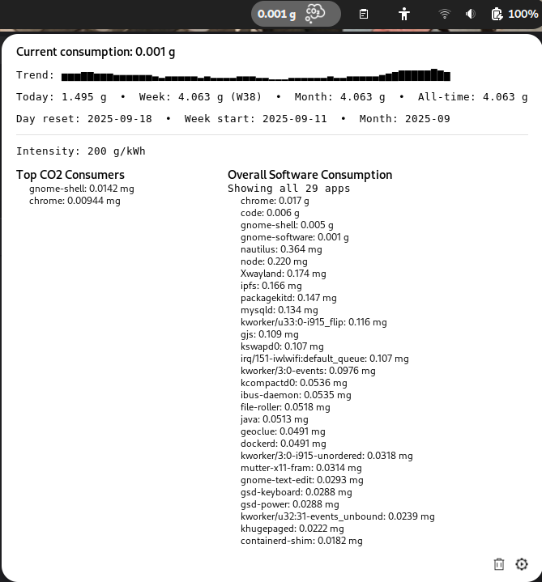

# CO2 Consumption Monitor — GNOME Shell Extension

A modern GNOME Shell extension that estimates real-time CO2 emissions from your computer usage using a lightweight, pure GJS (JavaScript) estimator. It displays a live indicator in the top panel and a popup with details—no Python or external daemons required.

## Features

- Real-time CO2 estimation in the top panel
- Per-application attribution using /proc sampling (top N)
- Libadwaita preferences with rich controls
- Optional live grid carbon intensity providers:
  - ElectricityMaps (API token)
  - Smart Auto (country average map) — can auto-detect country by IP when enabled
- Auto zone/country detection (via IP, optional)
- Smoothing and trend sparkline
- Monochrome mode with optional color coding (see note below)
- Safe Mode toggle for stability (disables online providers and per‑process sampling)
- Zero Python dependencies—pure JavaScript/GJS


 
- Persistent totals with automatic rollovers:

  - Today, Week, Month, and All‑time totals (g)

  - Week start day configurable (Monday/Sunday)
  - Period info row shows last reset day, week start date, and current YYYY‑MM month
- History and exports:
  - Rolling per‑day history for the last N days (configurable)
 
  - CSV export of daily history and a snapshot of totals
  - Auto‑export on day change and optional periodic export every N minutes
  - Profile names to namespace history/exports per user/workload
  - Import/Merge history from CSV or JSON via Preferences, with a recent‑history preview
- UX improvements:
  - Popup list rows get subtle colored badges (small dots) when color coding is enabled; text remains black for readability. The panel label stays neutral unless you theme it or disable Monochrome.
  - Intensity row shows country code and flag when available and names the provider when applicable

  - Bottom‑right popup controls: a gear icon opens Preferences and a trash icon clears stored totals; the controls are visually compact without separators

- Stability:

  - Removed UPower integration (avoids shell crashes on some systems)

  - Added Safe Mode option to minimize system impact (disables online lookups and per‑process tracking)


1. Copy the extension files to your GNOME extensions directory:

- GNOME Shell 43–48 (ES Modules/GJS)

## Installation

### Option A: Manual Installation

1. Download or clone this repository
1. Copy the extension files to your GNOME extensions directory:

```bash
mkdir -p ~/.local/share/gnome-shell/extensions/co2consumption@gmail.com
cp -r * ~/.local/share/gnome-shell/extensions/co2consumption@gmail.com/
```


1. Compile schemas and restart GNOME Shell (Alt+F2 → r on Xorg; relogin on Wayland)
1. Enable the extension using GNOME Extensions app or command line:


```bash
gnome-extensions enable co2consumption@gmail.com
```

### Option B: From GNOME Extensions Website

1. Visit [extensions.gnome.org](https://extensions.gnome.org)
2. Search for "CO2 Consumption Monitor"
3. Click "Install" and follow the instructions

## Usage

Once installed and enabled, the extension will:


1. Display current CO2 consumption in the top panel (e.g., "0.123g")

2. Show detailed breakdown when you click on the panel indicator:


  - Totals line: Today • Week (with week number) • Month • All‑time

  - Period info line: last day reset, week start date, and current month
  - Trend sparkline (if enabled)
  - Intensity row with value, country flag/code, and provider when applicable
  - Reset actions for Day/Week/Month/All‑time and export actions for CSV
  - Top N applications by CO2 usage (rows optionally color‑coded by severity)

  - Top CO2 Consumers (current interval) and Overall Software Consumption (cumulative). Preferences include a toggle to show all Overall totals; otherwise the Overall list is limited to Top N.

  - Bottom‑right controls: gear opens Preferences; trash clears stored totals
3. Updates at your configured interval

### Popup controls


- Gear icon: Opens Preferences (see [Configuration](#configuration)). This is equivalent to running `gnome-extensions prefs co2consumption@gmail.com`.
- Trash icon: Clears stored totals immediately (Daily, Weekly, Monthly, and All‑time). This does not delete your rolling per‑day history or any exported CSV files.

## Screenshot

Quick view of the popup showing colored badges and the bottom‑right controls:



If the image doesn’t render, ensure `data/screenshot-popup.png` exists locally.


### Understanding the Data


- Total CO2: Estimated grams emitted for the last interval
- Per-application CO2: Allocation of the interval’s emissions based on CPU time share
  - Very small per-app values are shown in mg for readability
- Color coding: The panel text can change color based on emission levels if enabled and your stylesheet defines colors (see below)


## Configuration


Access preferences through:

- GNOME Extensions app → CO2 Consumption Monitor → Settings
- Or: `gnome-extensions prefs co2consumption@gmail.com`


Available settings (in Preferences):


- Update interval (seconds)
- CPU profile (laptop, desktop, server, lowpower)

- Carbon intensity (fixed gCO2/kWh) or online provider (ElectricityMaps / Smart Auto)

- ElectricityMaps API key, zone, and auto zone detection


## How It Works

The estimator is implemented in pure JavaScript (GJS):

1. Samples CPU usage and per-process shares via /proc
2. Estimates power draw using a simple CPU power model (profile + frequency)
3. Converts energy for the update interval to CO2 using either a fixed carbon intensity or an online provider
4. Applies optional smoothing and generates a trend sparkline


## Troubleshooting


### Extension Not Showing Data


1. Check GNOME Shell logs:

```bash
journalctl -f -o cat /usr/bin/gnome-shell
```

### Provider Notes

- ElectricityMaps requires a valid API token and zone. If zone is empty and Auto‑detect is enabled, the extension tries to use your IP country code.
- Smart Auto uses a bundled country‑average dataset and, when Auto‑detect is enabled, attempts online IP geolocation to pick your country. If geolocation fails, it falls back to the fixed intensity value or any manually specified zone.
- Intensity display shows the detected country code with a flag emoji when possible, and the provider name when a provider is in use.

## Import / Export

### Software Totals (Overall)

- Export Overall Software Totals to CSV from Preferences. It creates `co2-overall-software-<profile>-top.csv` when limited to Top N, or `co2-overall-software-<profile>-all.csv` when “Show all” is enabled.
- Import Overall Software Totals from CSV (merges values by software name into your current profile). The expected CSV format is:

```csv
software,grams

Firefox,12.345678

gnome-shell,3.210000
```

- Tip: You can change the export directory in Preferences. Profile names namespace the files and stored data.

#### View all Overall totals quickly


- Use “Export Overall Software (All)” in Preferences to generate a full export regardless of the show‑all toggle.


### Show All Overall Totals

- Preferences include a toggle “Show all overall software totals”. When enabled, the popup shows the full cumulative list; when disabled, it limits to Top N (same as the current interval list limit).


You can export and import your data for backup or analysis:


- Export Totals to CSV: Writes a snapshot with daily/weekly/monthly/all‑time grams to `co2-consumption-totals.csv` in your chosen export directory (or your home if unset).
- Export Daily History (CSV): Writes per‑day history for the active profile to `co2-daily-history-<profile>.csv`.
- Auto‑export: When enabled, the extension auto‑exports the previous day’s history on day rollover.
- Periodic export: When enabled, the extension exports history every N minutes.
- Import/Merge History: In Preferences, you can import CSV or JSON; new days are merged, existing days are kept unless you explicitly overwrite via the UI.


Example (daily history CSV):

```csv
date,grams
2025-09-16,12.345678
2025-09-17,10.000000
```


Notes:

- Profile names namespace your history/exports (safe for multi‑use scenarios).
- If export directory is empty, the home directory is used.


## Known limitations


- Heuristic estimator: Power/CO2 estimates are approximate and optimized for responsiveness, not audit‑grade accuracy.
- CPU‑focused: Per‑process attribution is based on CPU time shares and does not include GPU or I/O energy models.
- Allocation approximation: Top‑N aggregation can omit tiny contributors to reduce UI churn; very small per‑app values show in mg.
- Provider accuracy: Online carbon intensity reflects provider/dataset assumptions and may differ from your utility’s metrics.

- Flags: Country flags rely on font support for emoji regional indicators.

- Reloading GNOME Shell: On Wayland you must logout/login; Alt+F2 → r works only on Xorg.

- GNOME versions: Tested on GNOME 43–48; older versions may lack supported APIs.

### Stability and Safe Mode


If you encounter instability on your system:

1. Open Preferences (via the gear button in the popup or the Extensions app)
2. Enable Safe Mode to disable per‑process monitoring and online provider lookups
3. Optionally increase the update interval and reduce per‑process Top N

### High CPU Usage


If the extension causes high CPU usage:


1. Increase the update interval in preferences
2. Reduce per-process sampling duration or Top N processes
3. Check for conflicting extensions
4. Restart GNOME Shell

## Contributing

We welcome contributions! Please:

1. Fork the repository

2. Create a feature branch

3. Make your changes
4. Test thoroughly
5. Submit a pull request

### Development Setup

1. Clone the repository
2. Symlink the folder to `~/.local/share/gnome-shell/extensions/co2consumption@gmail.com`
3. Compile schemas
4. Restart GNOME Shell and enable the extension

## License

This project is licensed under the GPL-3.0 License — see the LICENSE file for details.

## Acknowledgments

- GNOME Shell development community for excellent documentation
- ElectricityMaps and open data projects for providing intensity references
- Environmental sustainability advocates who inspired this project
- Developer: Adam Bouafia — [Portfolio](https://adam-bouafia.github.io/) | [LinkedIn](https://www.linkedin.com/in/adam-bouafia-b597ab86/)

## Changelog

### Unreleased

- Migrated to pure GJS estimator (no Python dependencies)
- Added ElectricityMaps and Smart Auto providers, optional auto zone detection
- Added smoothing, trend sparkline, and per-process controls

## Support

For issues, questions, or feature requests:

1. Check the troubleshooting section
2. Search existing GitHub issues
3. Create a new issue with detailed information

- Repository: <https://github.com/adam-bouafia/Gnome-Shell-CO2-Consumption-monitor-extension>
- Issues: <https://github.com/adam-bouafia/Gnome-Shell-CO2-Consumption-monitor-extension/issues>

## Privacy

This extension:

- Only monitors local system processes
- Persists totals and per‑day history in GNOME GSettings under the extension’s schema
- Writes CSV files to your chosen export directory when you trigger exports, enable auto‑export, or enable periodic export
- Does not send data anywhere unless you enable online features. When enabled:
  - ElectricityMaps requests are sent to api.electricitymap.org (requires your API token)
  - Auto‑detect zone uses an IP geolocation service (ipapi.co) to map to a country code
  - No telemetry is collected by the extension

Note: No CodeCarbon library is used; all estimation is implemented in pure GJS.

### Color coding and stylesheet

By default, `stylesheet.css` keeps the panel indicator monochrome (neutral text color) even when color-coding is enabled. The popup list uses subtle colored badges (small circular dots) before each row label to indicate severity when color coding is on. You can override or customize colors by styling these classes:

- `.co2-level-very-low`, `.co2-level-low`, `.co2-level-moderate`, `.co2-level-high`, `.co2-level-very-high`, `.co2-level-extreme`, `.co2-level-critical`

Popup badge classes (colorized on white background):

- `.badge.badge-very-low`, `.badge.badge-low`, `.badge.badge-moderate`, `.badge.badge-high`, `.badge.badge-very-high`, `.badge.badge-extreme`, `.badge.badge-critical`

Tips:

- Keep Monochrome mode enabled if you prefer a neutral panel label; popup badges stay colored when color-coding is on.
- Disable “Monochrome mode” and/or add theme overrides if you want the panel label to reflect severity as well.

